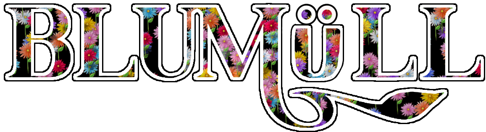

# KC3Hack 2022 Template

## プロダクト名 BluMüll(ブルームル)
 

## 選んだSDGsの目標
11:住み続けられるまちづくりを

## プロダクト説明
### 「街と人々に笑顔の花を」
このプロダクトは、ユーザー投稿型のごみ箱の場所を共有・検索することのできるWebマップサービスです。

使い方としては、位置情報の含まれた画像をアップロードすることで、具体的なゴミ箱がある場所の住所を知らなくてもマップ上のゴミ箱の場所に自動でピンを打ち、共有することが出来ます。他のユーザーが投稿したピンも見ることが出来るため、近くのごみ箱をマップから探すこともできます。マップサービスとしての住所検索機能も搭載済みです。ピンは花形になっており、世界（地図）に花を植えて彩っていくイメージで楽しく・気軽に投稿が出来ます。

このデバイスを開発したきっかけは、持続可能な開発目標(SDGs)11番の目標にある「2030年までに、大気の質及び一般並びに管理に特別な注意を払うことによるものを含め、都市の一人当たりの環境上の悪影響を軽減する。」がクリアされていないと感じたためです。現在街の中では、民間人によるポイ捨てが多くみられ、時には業者による不法投棄がニュースで報じられています。この現状について、私たちは、人々の環境保全に対する意識の低さや、ごみを捨てようと思っても近くにゴミ箱が見当たらず、ごみ箱の場所も分からないときがあることが原因の一部であると考えました。また、都市化や地域コミュニティの減少、昨今のコロナ禍により、人々の間で環境問題に対する意見や意識の共有機会が失われていることも一因であると考えました。そこで、これらの課題を解決するべく開発したのが「BluMüll」です。
このデバイスを利用すると、ユーザーが主体的にマップ作りに関わることによって人々の環境問題への意識を高め、ごみ箱の場所が共有されることでポイ捨ての減少にもつながると考えます。

なお、プロダクト名の「BluMüll(ブルームル)」は、ドイツ語で「花」を意味する「Blume」と、同じくドイツ語で「ゴミ」を意味する「Müll」を掛け合わせた造語です。ゴミを減らし、花や自然を増加させ、街及びそこで暮らす人々に笑顔の花を咲かせたい、という想いが込められています。

## 使用技術
- Python
- JavaScript
- HTML
- CSS
- Flask
- jinja2
- Sqlite3
- PIL
- Leaflet
- Leaflet Control OSM Geocoder

